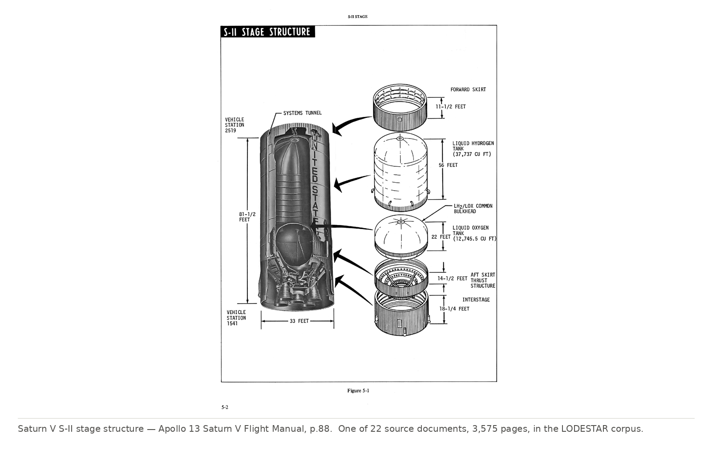
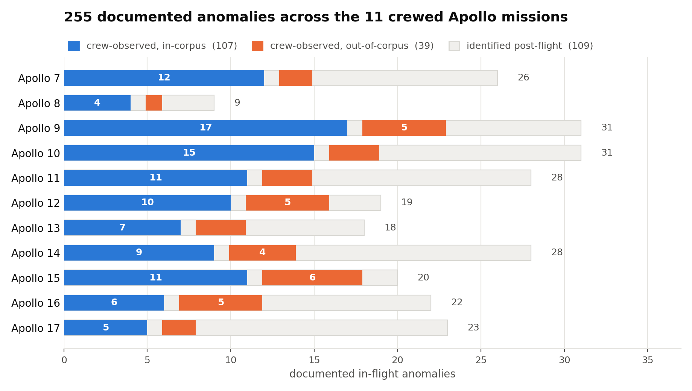
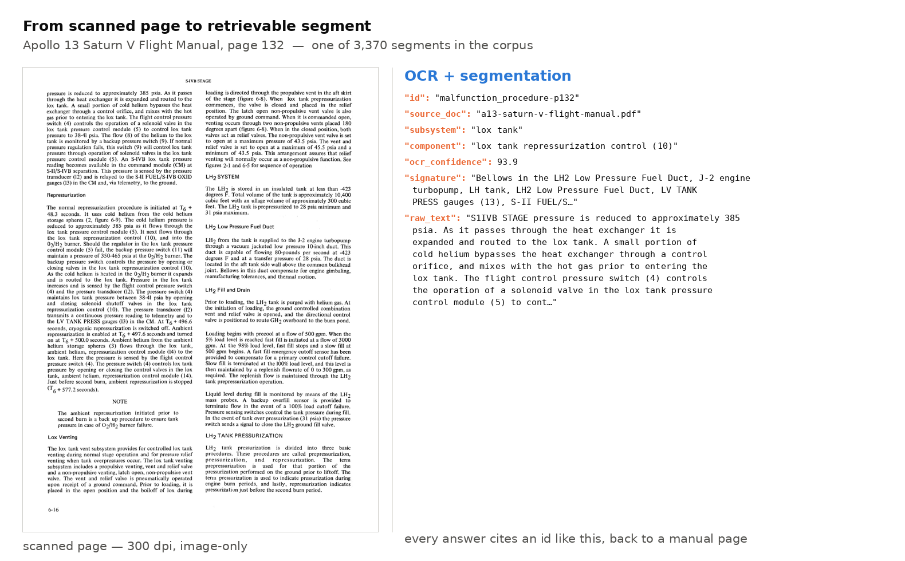

<div align="center">

# The Apollo Anomaly Atlas

**255 documented in-flight anomalies from the 11 crewed Apollo missions** — with the crew's own words, the cause established after the fact, and the corpus they were diagnosed against.

[](https://doi.org/10.5281/zenodo.22713950)
[](LICENSE)
[](LICENSE-CODE)
[](#citation)



</div>

---

## What this is

A benchmark for **onboard fault diagnosis**. Every entry is a fault that actually happened on a crewed Apollo mission, paired with what the crew said at the time and what the cause turned out to be after the flight.

Systems are scored by **transcript replay**: show the assistant the crew's verbatim words, one utterance at a time, and ask for the cause — with the post-flight record withheld. You cannot introduce real faults in orbit to validate a diagnostic assistant. This is the alternative.

The atlas is **system-agnostic**. No GPU, no model, no special hardware. Bring your own retrieval, ranking, or reasoning method.

## The sets

<picture>
  <source media="(prefers-color-scheme: dark)" srcset="docs/img/atlas_composition_dark.png">
  
</picture>

| Set | n | Filter |
|---|---:|---|
| All anomalies | **255** | — |
| Crew-observed | **146** | `crew_observed` |
| ├─ in-corpus — the accuracy set | **107** | `crew_observed AND in_corpus` |
| └─ out-of-corpus — the coverage set | **39** | `crew_observed AND NOT in_corpus` |
| Identified post-flight | 109 | no symptom report; not scored |

Report every number with its set. Accuracy is on the 107. Coverage AUC is over the 146, with `in_corpus` as the positive label. A single figure quoted over all 255 is not comparable to anything.

## The corpus



**3,370 segments** distilled from 22 Apollo 13 operational documents — the Operations Handbook, malfunction procedures, checklists, flight plans, mission rules — across roughly 3,575 scanned pages. 3,148 survive the boilerplate filter and form the retrievable set.

Two properties that matter:

**It is a pre-flight knowledge state.** No post-flight analyses, no mission reports, no accident-board findings, no air-to-ground transcripts. The corpus holds none of the record it is scored against.

**It is Apollo 13 documentation only, scored against all 11 missions.** That asymmetry is the design — out-of-corpus anomalies are largely other vehicles' hardware, which is what makes the coverage measure mean something.

## Quick start

```bash
git clone https://github.com/ARC-lab-University-of-Washington/apollo-anomaly-atlas
cd apollo-anomaly-atlas
```

```python
import json, csv

corpus = json.load(open("corpus/corpus.json"))          # 3,370 segments, full OCR text
atlas  = json.load(open("data/atlas_parsed.json"))      # 255 anomalies, 11 missions
rows   = list(csv.DictReader(open("data/anomalies.csv")))

# index however you like — BM25, dense, hybrid, graph
docs = [s["raw_text"] for s in corpus]

# replay: feed the crew's verbatim words, ask for the subsystem
for a in atlas["anomalies"]:
    if a["crew_initiated"]:
        prediction = your_system(a["symptom"])
        # score against a["subsystem"] / a["documented_cause"]
```

Scoring the same way the paper does:

```bash
python scripts/score_subsystem.py --pred yours.jsonl
```

## Layout

```
data/
  atlas_parsed.json             255 anomalies, canonical record
  anomalies.csv                 the same 255, flat, with the live in_corpus label
  crossmission_anomalies.json   cross-mission set used in the head-to-head comparison
  crossmission_human_turns.json Mission Control turn counts, hand-verified
  sources/manifest.csv          22 documents: pages, segments, SHA-256, archive
corpus/
  corpus.json                   3,370 segments with full OCR text and graph edges
scripts/
  subsystem_match.py            defines is_in_corpus — the split lives here
  score_subsystem.py            subsystem scoring
baselines/
  decisions_146_k8.jsonl        the 146 scored decisions behind the paper
  coverage_roc_146.csv          the ROC behind AUC 0.75
  coverage_in_out_summary.csv   in/out coverage distributions
  corpus_composition.csv        3,370 → 3,148 accounting
  crossmission_lodestar*.jsonl  dev-box and Jetson runs
```

## Known limitations

- **Ground truth is the post-flight established cause**, sometimes revised months after the mission. `confidence` marks how firm each one is.
- **Symptom reports are verbatim**, disfluencies and transcription uncertainty included. Cleaning them would make the task easier than the real one.
- **Segment metadata is OCR-derived and was never hand-verified.** Coverage is partial — component ~40%, signature ~59%, symptoms ~16%. `ocr_confidence` ships beside every segment. Treat these as retrieval aids, not ground truth.
- **The head-to-head comparison spans two files.** Only 6 of the 18 turn-verified anomalies carry turn counts inside `atlas_parsed.json`; the rest come from `data/crossmission_*`. Use both.
- **Apollo-era systems are not Artemis-era systems.** This measures diagnostic reasoning over documented procedure, not transfer to current vehicles.

## Source documents

`data/sources/manifest.csv` records all 22 with page counts, segment counts, SHA-256 checksums, and the archive they came from — the [Apollo Flight Journal](https://apollojournals.org/afj/documents.html) general documents collection. Checksums let anyone confirm they have the same scans.

The searchable, OCR'd source PDFs are deposited separately. They include contractor works — the LM Operations Handbook is Grumman, the CSM checklists North American Rockwell — so rights are recorded per document rather than asserted in bulk.

## Licensing

- **Data, corpus, annotations** — [CC BY 4.0](LICENSE)
- **Scripts** — [BSD 3-Clause](LICENSE-CODE)

## Citation

Please cite both the dataset and the paper.

```bibtex
@misc{apolloatlas2026,
  author = {Nathan, Gokul and Pasupathi, Kavimitiran and Shen, Yile and
            Stafford, Maxwell and Shao, Kevin and Mamishev, Alexander and Makhsous, Sep},
  title  = {The {Apollo} {Anomaly} {Atlas}: 255 Documented In-Flight Anomalies
            from the Crewed {Apollo} Missions},
  year   = {2026}, howpublished = {Zenodo}, doi = {10.5281/zenodo.22713950}
}
```

Companion system: [**LODESTAR**](https://github.com/ARC-lab-University-of-Washington/lodestar-fdx.git) — an offline, on-device, citation-grounded fault-diagnosis assistant.

<div align="center">
<sub>ARC Lab · University of Washington</sub>
</div>
